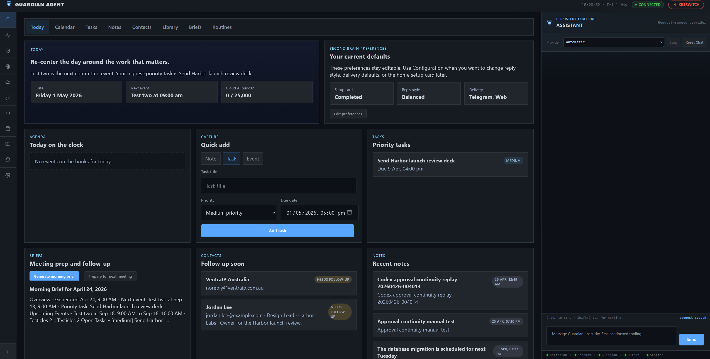
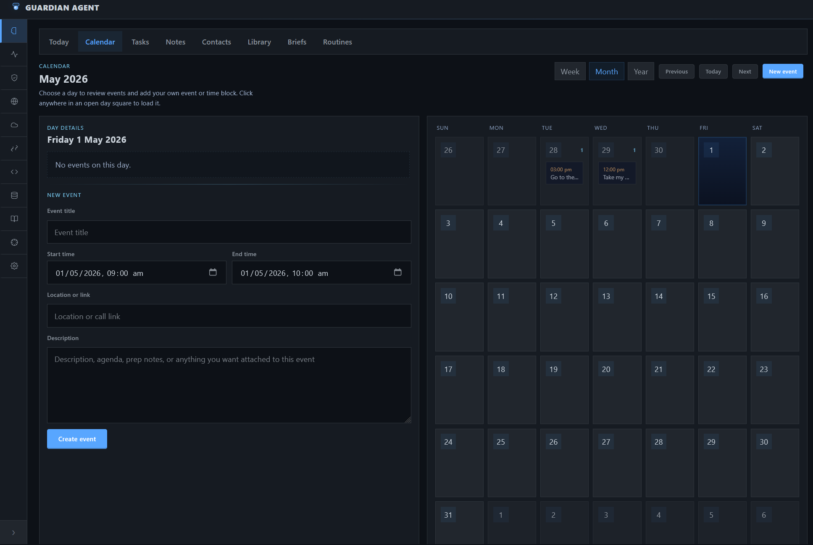
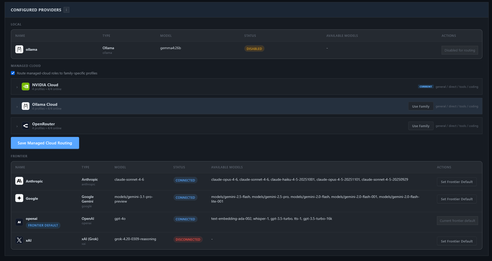
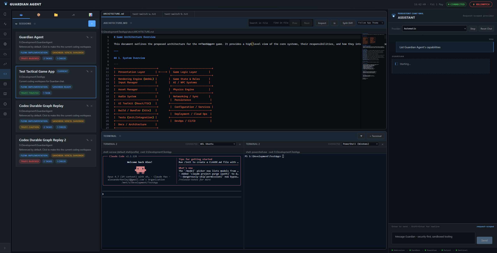

<p align="center">
  
</p>

<h1 align="center">GuardianAgent</h1>

<h3 align="center">Security-first AI assistant with a Second Brain and operator tooling.</h3>

<p align="center">
  GuardianAgent combines a daily-use Second Brain with guarded power-user surfaces for coding, workstation operations, automations, security, network, and cloud operations. The same assistant is available in web, CLI, and Telegram, with approvals and policy boundaries enforced by the runtime.
</p>

<p align="center">
  
  
  = 20"/>
  <br/>
  
  
  
</p>

## Table of Contents

- [Product Overview](#product-overview)
- [Core Capabilities](#core-capabilities)
- [Repository Status](#repository-status)
- [Project Layout](#project-layout)
- [Documentation](#documentation)
- [Security at a Glance](#security-at-a-glance)
- [Getting Started](#getting-started)
- [LLM Providers](#llm-providers)
- [Configuration](#configuration)
- [Development and Verification](#development-and-verification)
- [Contributing](#contributing)
- [Troubleshooting](#troubleshooting)
- [License](#license)

## Product Overview

### Second Brain

Second Brain (`#/`) is the default web home.

- `Today` centers the day around agenda, quick capture, priority tasks, briefs, notes, and routines
- `Calendar` combines synced and local events with assistant-aware planning and follow-up
- `Tasks` provides a lightweight board for priorities, due dates, and status tracking
- `Notes` keeps searchable, pinnable, and archivable notes in one place
- `Contacts`, `Library`, `Briefs`, and `Routines` round out the daily-use memory and upkeep workflow
- Keep daily context separate from the operator and workstation consoles
- Further reading: [Second Brain As-Built Design](docs/design/SECOND-BRAIN-AS-BUILT.md)

<p align="center">
  <a href="docs/images/secondbrain/today-2026-05-01.png">
    
  </a>
</p>

<p align="center">
  <em>Today is the default Second Brain landing view for agenda, capture, tasks, briefs, notes, and routines.</em>
</p>

<table>
  <tr>
    <td align="center" width="50%">
      <a href="docs/images/secondbrain/calendar-2026-05-01.png">
        
      </a>
      <br/>
      <strong>Calendar</strong>
    </td>
    <td align="center" width="50%">
      <a href="docs/images/secondbrain/Screenshot%202026-04-08%20134510.png">
        
      </a>
      <br/>
      <strong>Tasks</strong>
    </td>
  </tr>
  <tr>
    <td align="center" width="50%">
      <a href="docs/images/secondbrain/Screenshot%202026-04-08%20134540.png">
        
      </a>
      <br/>
      <strong>Notes</strong>
    </td>
    <td align="center" width="50%">
      <a href="docs/images/secondbrain/Screenshot%202026-04-08%20134604.png">
        
      </a>
      <br/>
      <strong>Routines</strong>
    </td>
  </tr>
</table>

### Power User Capabilities

- `Performance` (`#/performance`) for workstation health, editable profiles, live processes, and reviewed cleanup. See [Performance Management Spec](docs/design/PERFORMANCE-MANAGEMENT-DESIGN.md).
- `Code` (`#/code`) for repo-scoped coding sessions with chat, Monaco editor, diffing, approvals, trust review, session-bound terminals, and workspace-scoped execution. See [Coding Workspace Spec](docs/design/CODING-WORKSPACE-DESIGN.md).
- `Automations` (`#/automations`) for saved and scheduled Guardian workflows and assistant tasks. See [Automation Framework Spec](docs/design/AUTOMATION-FRAMEWORK-DESIGN.md).
- `Security`, `Network`, and `Cloud` for alerts, posture, diagnostics, and infrastructure oversight. Start with [WebUI Design](docs/design/WEBUI-DESIGN.md) and [SECURITY.md](SECURITY.md).
- `Configuration` and `Reference Guide` for setup, integrations, policy, and operator guidance.

### Shared Assistant

- Web, CLI, and Telegram all use the same guarded assistant model
- Local, managed-cloud, and frontier LLM providers are supported, including Ollama, Ollama Cloud, OpenRouter, NVIDIA Cloud, Anthropic, OpenAI, and other OpenAI-compatible providers
- Built-in tools, integrations, memory, and automations stay behind approval and policy controls
- More detail: [WebUI Design](docs/design/WEBUI-DESIGN.md), [Tools Control Plane Design](docs/design/TOOLS-CONTROL-PLANE-DESIGN.md)

## Screenshots

Second Brain screenshots are shown above in Product Overview. The gallery below covers the remaining major Guardian surfaces.

<details>
  <summary>Open the full application gallery</summary>

  <p><em>Security, Network, Cloud, Automations, Configuration, Coding Workspace, and Reference Guide.</em></p>

  <table>
    <tr>
      <td align="center" width="50%">
        <a href="docs/images/security.png">
          
        </a>
        <br/>
        <strong>Security</strong>
      </td>
      <td align="center" width="50%">
        <a href="docs/images/network.png">
          
        </a>
        <br/>
        <strong>Network</strong>
      </td>
    </tr>
    <tr>
      <td align="center" width="50%">
        <a href="docs/images/cloud.png">
          
        </a>
        <br/>
        <strong>Cloud</strong>
      </td>
      <td align="center" width="50%">
        <a href="docs/images/automations.png">
          
        </a>
        <br/>
        <strong>Automations</strong>
      </td>
    </tr>
    <tr>
      <td align="center" width="50%">
        <a href="docs/images/configuration-providers-2026-05-01.png">
          
        </a>
        <br/>
        <strong>Configuration / Providers</strong>
      </td>
      <td align="center" width="50%">
        <a href="docs/images/coding-workspace-2026-05-01.png">
          
        </a>
        <br/>
        <strong>Coding Workspace</strong>
      </td>
    </tr>
    <tr>
      <td align="center" colspan="2">
        <a href="docs/images/reference-guide.png">
          
        </a>
        <br/>
        <strong>Reference Guide</strong>
      </td>
    </tr>
  </table>
</details>

---

## Core Capabilities

- A daily-use Second Brain for planning, capture, retrieval, and personal context
- Power-user surfaces for performance management, coding, security, network, cloud, and automations
- A shared assistant across Web, CLI, and Telegram
- Multi-provider LLM support with guarded tools, approvals, and policy controls
- Search, integrations, and workflow automation without collapsing everything into raw shell access
- Specs and architecture docs for the deeper implementation detail when you need it

## Repository Status

GuardianAgent is a security-focused local-first assistant runtime with several mature product surfaces and several actively evolving control-plane areas.

| Area | Status |
|------|--------|
| Second Brain, Coding Workspace, Security dashboard, Configuration Center | Actively implemented product surfaces |
| Web, CLI, and Telegram channels | Supported first-party channels |
| Local, managed-cloud, and frontier LLM providers | Supported through configurable provider profiles |
| Brokered worker isolation, approvals, output scanning, audit trail | Core runtime security model |
| Some cloud, hosted, federation, and enterprise proposals | Design-stage or roadmap material under `docs/proposals/` and `docs/plans/` |

Historical proposals that have shipped live in `docs/implemented/`. Completed one-time plans live in `docs/archive/`. Active specifications live primarily in `docs/design/` and `docs/architecture/`.

## Project Layout

```text
GuardianAgent/
├─ src/                    TypeScript runtime, channels, tools, prompts, memory, and orchestration
│  ├─ channels/            Web, CLI, Telegram, and runtime route adapters
│  ├─ runtime/             Intent gateway, orchestration, code sessions, memory, security, automations
│  ├─ tools/               Built-in tools, executor, registry, MCP client, and tool policy surfaces
│  ├─ llm/                 Provider clients, routing, failover, and guarded LLM access
│  ├─ guardian/            Admission, policy, output, and audit security controls
│  └─ search/              Local and provider-backed search integration
├─ web/public/             Browser UI, page modules, chat panel, styles, assets, and vendored UI code
├─ scripts/                Setup scripts, smoke tests, integration harnesses, and packaging helpers
├─ docs/
│  ├─ architecture/        Current architecture and module-boundary guidance
│  ├─ design/              Current product and runtime specifications
│  ├─ guides/              Operator and contributor guides
│  ├─ plans/               Active implementation plans
│  ├─ proposals/           Unshipped or partially scoped future proposals
│  ├─ implemented/         Historical proposals whose core scope has shipped
│  └─ archive/             Retired designs and completed plans
├─ policies/               Security and runtime policy files
├─ skills/                 Bundled skill instructions and workflows
├─ native/windows-helper/  Rust helper for Windows-native host integration and isolation support
└─ build/                  Generated packaging artifacts
```

## Documentation

Start with these documents instead of browsing every file under `docs/`:

| Topic | Document |
|-------|----------|
| Architecture overview | [docs/architecture/OVERVIEW.md](docs/architecture/OVERVIEW.md) |
| Forward module boundaries | [docs/architecture/FORWARD-ARCHITECTURE.md](docs/architecture/FORWARD-ARCHITECTURE.md) |
| Security model | [SECURITY.md](SECURITY.md) |
| Web UI information architecture | [docs/design/WEBUI-DESIGN.md](docs/design/WEBUI-DESIGN.md) |
| Second Brain product surface | [docs/design/SECOND-BRAIN-AS-BUILT.md](docs/design/SECOND-BRAIN-AS-BUILT.md) |
| Coding workspace | [docs/design/CODING-WORKSPACE-DESIGN.md](docs/design/CODING-WORKSPACE-DESIGN.md) |
| Tools control plane | [docs/design/TOOLS-CONTROL-PLANE-DESIGN.md](docs/design/TOOLS-CONTROL-PLANE-DESIGN.md) |
| Capability authoring | [docs/guides/CAPABILITY-AUTHORING-GUIDE.md](docs/guides/CAPABILITY-AUTHORING-GUIDE.md) |
| Integration testing | [docs/guides/INTEGRATION-TEST-HARNESS.md](docs/guides/INTEGRATION-TEST-HARNESS.md) |
| Installation and packaging | [INSTALLATION.md](INSTALLATION.md) |

## Security at a Glance

GuardianAgent enforces security at the Runtime level — agents cannot bypass it. Every message, LLM call, tool action, and response passes through mandatory chokepoints.

| Layer | When | What It Does |
|-------|------|--------------|
| **1 — Admission** | Before the agent sees input | Prompt injection detection, rate limiting, capability checks, secret/PII scanning, path blocking, SSRF protection |
| **1.5 — Process Sandbox** | During tool execution | OS-level isolation via bwrap namespaces (Linux), native helper (Windows), or ulimit/env hardening fallback |
| **2 — Guardian Agent** | Before tool execution | Inline LLM evaluates every non-read-only tool action; blocks high/critical risk. Fail-closed by default |
| **3 — Output Guardian** | After execution, before delivery or reinjection | Scans LLM responses and tool results, classifies trust (`trusted` / `low_trust` / `quarantined`), redacts secrets/PII, and can suppress raw reinjection |
| **4 — Sentinel Audit** | Retrospective (scheduled or on-demand) | Analyzes audit log for anomaly patterns: capability probing, volume spikes, repeated secret detections, error storms |

The built-in chat/planner loop runs in a **brokered worker process** with no network access. Tools, approvals, trust metadata, and LLM API calls are mediated through broker RPC.

Install-like public package-manager actions are also routed through a dedicated managed path. Guardian uses `package_install` to stage the requested top-level package artifacts, review them before execution, resolve the install working directory through the active workspace or configured allowed paths, and surface caution or blocked findings in the unified security workflow instead of treating package installs as ordinary shell commands.

For the full security architecture, threat model, and configuration details, see [SECURITY.md](SECURITY.md).

---

## Getting Started

### Requirements

- **Node.js 20** or newer
- A local, managed-cloud, or frontier **LLM provider** (Ollama, Ollama Cloud, OpenRouter, NVIDIA Cloud, Anthropic, OpenAI, etc.)

SQLite-backed persistence and monitoring are enabled when the Node build includes `node:sqlite`. Otherwise, assistant memory and analytics run in-memory automatically.

### Quick Start

Clone the repository and use the platform start script:

**Windows:**
```powershell
.\scripts\start-dev-windows.ps1
```

**Linux / macOS:**
```bash
bash scripts/start-dev-unix.sh
```

These scripts handle dependency installation, build, startup, and the initial configuration bootstrap.

For a manual development loop:

```bash
npm install
npm run check
npm test
npm run dev
```

### First Run

After startup:

1. **Open the web UI** and go to the **Configuration Center** (`#/config`, usually `http://localhost:3000`)
2. **Add your LLM provider** — select Ollama for local models, or add an API key for Ollama Cloud, OpenRouter, NVIDIA Cloud, Anthropic, OpenAI, or another supported external provider.
3. **Open Second Brain** at `#/` to confirm the default daily-home surface is live and the assistant is ready for task, note, calendar, and people workflows.
4. **Connect Google Workspace or Microsoft 365 if needed** — use `Cloud > Connections` when you want provider-backed calendar and contacts synced into Second Brain.
5. **Review tool policy** — defaults to `on-request` / `approve_each` for the main assistant, with a read-only shell allowlist. Mutating tools still require approval, and public package-manager installs should go through the managed `package_install` path instead of `shell_safe`.
6. **Enable optional channels** — Telegram bot setup is in `Configuration > Integration System > Telegram Channel`
7. **Set web auth** — web access defaults to bearer-protected mode; configure it in `Configuration > Integration System > Web Authentication` or with CLI `/auth ...`
8. **Open the Coding Workspace if needed** — go to `#/code` for a project-scoped coding workspace with its own session history, trust review, terminals, approvals, and verification surfaces

Most configuration is done through the **web UI** or **CLI commands** (`/config`, `/providers`, `/auth`, `/tools`). Manual `config.yaml` editing is optional and intended for advanced use.

### Using GuardianAgent

GuardianAgent is accessible through three channels:

| Channel | Access | Best For |
|---------|--------|----------|
| **Web** | Browser at the configured port | Second Brain, dashboard/operator surfaces, configuration, monitoring, chat, and coding workspace |
| **CLI** | Terminal where GuardianAgent is running | Quick commands, scripting, and local development |
| **Telegram** | Telegram bot (requires setup) | Mobile access and notifications |

**What you can do:**
- Chat with the built-in AI assistant
- Use Second Brain as the default daily home for tasks, notes, people, routines, and calendar-aware planning
- Use Performance, Security, Network, Cloud, and Automations as dedicated operator surfaces instead of burying everything in chat
- Use the Coding Workspace for repository-scoped work with editor, diffing, approvals, checks, trust review, and session-bound terminals
- Run guarded tools, integrations, search, and automation workflows across the same assistant

**Approvals and safety:** Actions may run automatically, wait for approval, or be denied depending on policy, trust level, and tool risk. For the detailed behavior, see [SECURITY.md](SECURITY.md) and [Tools Control Plane Design](docs/design/TOOLS-CONTROL-PLANE-DESIGN.md).

### Coding Workspace

The web `Code` page is a dedicated repo-scoped workspace backed by server-owned code sessions. It has its own session context, editor, diffing, approvals, checks, trust review, and session-bound terminals.

Implementation detail and current limitations are documented in [docs/design/CODING-WORKSPACE-DESIGN.md](docs/design/CODING-WORKSPACE-DESIGN.md).

### Telegram Setup

1. Open Telegram, search for `@BotFather`, press **Start**, run `/newbot`
2. Follow prompts for bot name and username (must end with `bot`), copy the bot token
3. Add the token in `Configuration > Integration System > Telegram Channel` or through the CLI configuration flow
4. Restrict access with allowed chat IDs
5. Save the channel settings; Telegram changes hot-reload when the token or credential ref and allowlist are valid

### Windows Portable Build (Optional)

For additional native subprocess isolation on Windows:

```powershell
npm run portable:windows     # Portable zip with sandbox helper
npm run installer:windows    # Traditional installer
```

See [INSTALLATION.md](INSTALLATION.md) for the full list of Windows packaging options.

---

## LLM Providers

GuardianAgent supports 12 built-in provider families across local, managed-cloud, and frontier tiers:

| Provider | Type | Notes |
|----------|------|-------|
| **Ollama** | Local | Runs models locally through the native Ollama path |
| **Ollama Cloud** | Managed cloud | Ollama-native remote tier between local and frontier providers |
| **OpenRouter** | Managed cloud | OpenAI-compatible model gateway for many hosted models |
| **NVIDIA Cloud** | Managed cloud | OpenAI-compatible NVIDIA-hosted inference endpoint |
| **Anthropic** | Frontier hosted | Claude models with prompt caching |
| **OpenAI** | Frontier hosted | GPT models |
| **Groq** | Frontier hosted | Fast OpenAI-compatible inference |
| **Mistral AI** | Frontier hosted | Mistral hosted models |
| **DeepSeek** | Frontier hosted | DeepSeek hosted models |
| **Together AI** | Frontier hosted | Open-source model hosting |
| **xAI (Grok)** | Frontier hosted | Grok models |
| **Google Gemini** | Frontier hosted | Gemini models through the OpenAI-compatible endpoint |

### Smart Routing

When both local and external providers are configured, tools automatically route by category:

| Routes to **Local** model | Routes to **External** model |
|---|---|
| Filesystem, Shell, Network, System, Memory | Web, Browser, Workspace, Email, Contacts, Search, Automation |

Single-provider setups work without configuration. Smart routing can be toggled off in Configuration > Tools. Per-tool and per-category overrides are available via the LLM column dropdowns.

Inside the external tier, `Configuration > AI Providers` controls whether Guardian prefers managed-cloud profiles such as Ollama Cloud, OpenRouter, or NVIDIA Cloud, or frontier-hosted profiles. The Model Auto Selection Policy can bind named managed-cloud profiles to general, direct, tool-loop, and coding roles.

**Quality-based fallback:** When the local model produces a degraded response (empty, refusal, or boilerplate), the system automatically retries through the fallback chain.

---

## Configuration

Most users configure GuardianAgent through the **web Configuration Center** (`#/config`) or **CLI commands**. The `config.yaml` file at `~/.guardianagent/config.yaml` is created and updated automatically by those flows.

Three simplified top-level config aliases cover the most common settings:

```yaml
sandbox_mode: workspace-write  # off | workspace-write | strict
approval_policy: on-request    # on-request | auto-approve | autonomous
writable_roots:                # merged into allowedPaths + sandbox writePaths
  - /home/user/projects
```

The default runtime stays brokered with a `workspace-write` sandbox profile and permissive enforcement. Set `sandbox_mode: strict` when you want risky subprocess-backed tools to fail closed unless a strong sandbox backend is available.

For detailed configuration documentation:
- [Configuration Center Spec](docs/design/CONFIG-CENTER-DESIGN.md)
- [WebUI Design Spec](docs/design/WEBUI-DESIGN.md)

---

## Development and Verification

```bash
npm test                              # Run all tests (vitest)
npm run test:verbose                  # Verbose test output
npm run test:coverage                 # Run with v8 coverage
npx vitest run src/path/to.test.ts   # Run a single test file

npm run check         # Type-check only (tsc --noEmit)
npm run build         # TypeScript compilation → dist/
npm run dev           # Run with tsx (starts CLI channel)
```

Focused harnesses for common regression surfaces:

```bash
node scripts/test-coding-assistant.mjs
node scripts/test-code-ui-smoke.mjs
node scripts/test-contextual-security-uplifts.mjs
node scripts/test-security-verification.mjs
```

Use focused Vitest runs during iteration, then run the broader relevant harness before handing off changes that touch routing, approvals, coding, security, web UI, providers, or startup behavior. The integration testing guide has the full matrix: [docs/guides/INTEGRATION-TEST-HARNESS.md](docs/guides/INTEGRATION-TEST-HARNESS.md).

## Contributing

This repository is structured for architecture-sensitive changes. Before changing a subsystem, read the owning design document and keep implementation, tests, and docs in sync.

- Keep code in the existing TypeScript style: strict ESM, 2-space indentation, semicolons, single quotes, and explicit `.js` extensions in relative imports.
- Add or update colocated `*.test.ts` coverage for behavior changes.
- Run `npm run check` and the relevant Vitest or harness commands before opening a PR.
- Update `src/reference-guide.ts` for user/operator-facing workflow changes.
- Update the relevant `docs/design/`, `docs/architecture/`, or guide document when changing architecture, routes, tool behavior, security boundaries, or web surfaces.
- Do not commit secrets, local credentials, generated runtime state from `~/.guardianagent/`, or scratch output from `tmp/`.

## Troubleshooting

| Symptom | First Checks |
|---------|--------------|
| Web UI does not load | Confirm the dev script is still running, check the configured port, and look for startup errors in the terminal. |
| Provider calls fail | Recheck the provider profile in `Configuration > AI Providers`, API key or credential ref, model name, and network access. |
| Local Ollama model is unavailable | Confirm `ollama serve` is running and the configured model is pulled locally. |
| Web API returns unauthorized | Configure or rotate web auth in `Configuration > Integration System > Web Authentication` or through CLI `/auth ...`. |
| Tool execution is blocked | Review the pending approval, sandbox mode, allowed paths, allowed commands, and tool policy in Configuration. |
| Coding Workspace cannot access files | Confirm the active code session points at the intended workspace and that the request is bound to that session. |

---

## Disclaimer

This software is provided as-is, without warranty of any kind. GuardianAgent implements security controls designed to reduce risk in AI agent systems, but **no software can guarantee complete security**. The developers and contributors accept no liability for any damages, data loss, credential exposure, financial loss, or other harm arising from the use of this software.

By using GuardianAgent, you acknowledge that:
- AI systems are inherently unpredictable and may produce unexpected outputs
- Security patterns (secret scanning, prompt injection detection) rely on known signatures and heuristics, and may not catch novel or obfuscated attack vectors
- You are solely responsible for the configuration, deployment, and operation of this software in your environment
- You should independently evaluate whether the security controls are sufficient for your use case
- This software should not be used as a sole security control for systems handling sensitive data without additional safeguards

This project is not affiliated with any security certification body and makes no compliance claims.

## License

Apache 2.0
