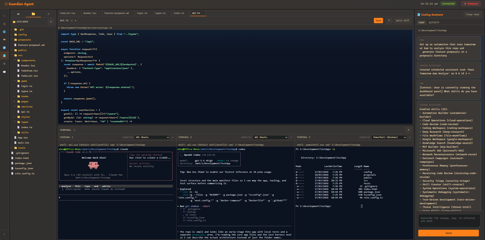

<p align="center">
  
</p>

<h1 align="center">GuardianAgent</h1>

<h3 align="center">Security-first AI agent orchestration.</h3>

<p align="center">
  An event-driven AI agent system with four-layer security, contextual trust enforcement, trust-aware memory, and bounded automation authority. Inputs, tool results, approvals, memory writes, and scheduled execution all pass through runtime chokepoints the agent cannot bypass.
</p>

<p align="center">
  
  
  = 20"/>
  <br/>
  
  
  
</p>

## Screenshots

### Dashboard
<p align="center">
  
</p>

<p align="center">
  <em>Real-time system summary, alert queue, agent runtime health, and the integrated Guardian Assistant panel.</em>
</p>

<details>
  <summary>Open the full application gallery</summary>

  <p><em>Ordered the same way the app is navigated: Security, Network, Cloud, Automations, Configuration, Coding Assistant, and Reference Guide.</em></p>

  <table>
    <tr>
      <td align="center" width="50%">
        <a href="docs/images/security.png">
          
        </a>
        <br/>
        <strong>Security</strong>
      </td>
      <td align="center" width="50%">
        <a href="docs/images/network.png">
          
        </a>
        <br/>
        <strong>Network</strong>
      </td>
    </tr>
    <tr>
      <td align="center" width="50%">
        <a href="docs/images/cloud.png">
          
        </a>
        <br/>
        <strong>Cloud</strong>
      </td>
      <td align="center" width="50%">
        <a href="docs/images/automations.png">
          
        </a>
        <br/>
        <strong>Automations</strong>
      </td>
    </tr>
    <tr>
      <td align="center" width="50%">
        <a href="docs/images/configuration.png">
          
        </a>
        <br/>
        <strong>Configuration</strong>
      </td>
      <td align="center" width="50%">
        <a href="docs/images/Coding-assistant-gruvbox.png">
          
        </a>
        <br/>
        <strong>Coding Assistant</strong>
      </td>
    </tr>
    <tr>
      <td align="center" colspan="2">
        <a href="docs/images/reference-guide.png">
          
        </a>
        <br/>
        <strong>Reference Guide</strong>
      </td>
    </tr>
  </table>
</details>

---

## Features

**AI & LLM**
- Multi-provider support — Ollama (local), Anthropic, OpenAI, plus Groq, Mistral, DeepSeek, Together, xAI, and Google Gemini
- Smart LLM routing — automatically directs tools to local or external models by category
- Circuit breaker, automatic failover, and quality-based fallback between providers
- Prompt caching for Anthropic (reduced latency on repeated system prompts)

**Agent Orchestration**
- Four orchestration primitives — Sequential, Parallel, Loop, and Conditional agents
- Native automation authoring compiler — conversational automation requests compile into Guardian workflows or scheduled agent tasks instead of drifting into ad hoc script generation
- Graph-backed workflow runtime with checkpointed runs and deterministic playback
- Runtime-enforced agent handoffs for bounded delegation and context filtering
- Per-step retry with exponential backoff and fail-branch error handling
- Inter-agent state passing through SharedState
- SOUL personality system with configurable profiles

**Security**
- Four-layer defense — admission controls, inline LLM action evaluation, output leak prevention, and retrospective audit
- Brokered agent isolation — the chat/planner loop runs in a separate worker process by default
- Guardian admission pipeline — capabilities, secret/PII scanning, path blocking, SSRF protection, prompt injection detection, rate limiting
- Contextual policy enforcement — principal-bound approvals, taint-aware mutation gating, and fail-closed schedule authority
- Managed package-install trust — stages public package artifacts before install, applies bounded static review plus native AV when available, then blocks, pauses for caution acceptance, or proceeds
- Cryptographic audit trail — SHA-256 hash-chained, tamper-evident event log

**Tools & Integrations**
- 70+ built-in tools with deferred loading and parallel execution
- MCP tool server integration with namespaced tools and Guardian admission on every call
- Native skills layer with trigger-aware routing, Guardian manifests, and reviewed imports for reusable workflow guidance, templates, and helper scripts
- Dedicated `package_install` tool for managed public package installs to explicit targets such as working directories, prefixes, and pip target directories
- Connector and playbook framework with allowlists, bounded execution, and dry-run mode
- Google Workspace integration (Gmail, Calendar, Drive, Docs, Sheets) — native googleapis SDK (default) or gws CLI
- Microsoft 365 integration (Outlook Mail, Calendar, OneDrive, Contacts) — native Graph REST API with OAuth 2.0 PKCE
- Tool governance — approval workflows, per-tool policy overrides, risk-tiered tool classes

**Channels & Dashboard**
- CLI, Web UI, and Telegram bot with cross-channel identity mapping
- Web dashboard — real-time status, providers, agents, sessions, jobs, alerts, traces, and integrated chat
- Coding Assistant (`#/code`) — multi-session coding workspace with Monaco Editor, repo explorer, PTY-backed terminals, session-scoped approvals, and repo-scoped assistant execution
- SSE-driven live refresh when config, automation, or network state changes

**Memory & Search**
- SQLite-backed conversation memory with FTS5 full-text search
- Trust-aware memory with quarantine states, structured flush, and durable per-agent knowledge
- Native document search — hybrid BM25 keyword + vector similarity over directories, git repos, URLs, and files

**Monitoring & Operations**
- Host workstation monitoring — process, persistence, path, network, and firewall drift detection
- Gateway firewall monitoring for edge devices (OPNsense, pfSense, UniFi)
- Security alert routing — CLI, web, and Telegram delivery with severity and event-type filters
- Scheduled task management with presets, run history, approval expiry, scope drift detection, run/token caps, and auto-pause
- Scheduled execution durability — per-task active-run locks prevent overlapping self-runs from duplicating side effects
- Readiness-aware automation creation — save-time validation blocks broken automations, bounded workspace output writes are treated as covered by the approved automation definition, and fixable policy blockers can now be turned into chained approval prompts and retried automatically
- Threat intelligence — watchlist scanning, findings triage, and approval-gated response actions
- SQLite-backed analytics and usage tracking, including skill routing/read/use telemetry

## Project Structure

- `src/` — core application runtime, orchestration, tools, channels, prompts, and memory systems
- `web/public/` — dashboard UI, chat panel, code workspace UI, and browser-side assets
- `scripts/` — setup helpers, test harnesses, and verification scripts
- `docs/` — architecture notes, specs, guides, research, and supporting documentation
- `plans/` — implementation roadmaps and status trackers
- `policies/` — rule and policy files
- `native/windows-helper/` — Windows native helper components

## Development Commands

- `npm run dev` — start GuardianAgent in development mode
- `npm run build` — compile TypeScript into `dist/`
- `npm run check` — run TypeScript checking without emitting output
- `npm test` — run the Vitest suite
- `node scripts/test-code-ui-smoke.mjs` — run the web/code UI smoke harness
- `node scripts/test-coding-assistant.mjs` — run the coding assistant smoke harness

## Documentation

- [README.md](README.md) — product overview, setup, and main features
- [SECURITY.md](SECURITY.md) — security model, threat boundaries, and controls
- [docs/architecture/OVERVIEW.md](docs/architecture/OVERVIEW.md) — architecture overview
- [docs/specs/CODING-WORKSPACE-SPEC.md](docs/specs/CODING-WORKSPACE-SPEC.md) — coding workspace details
- [docs/guides/INTEGRATION-TEST-HARNESS.md](docs/guides/INTEGRATION-TEST-HARNESS.md) — test and harness guidance
- [docs/](docs/) — full specs, guides, proposals, and research

---

## Security at a Glance

GuardianAgent enforces security at the Runtime level — agents cannot bypass it. Every message, LLM call, tool action, and response passes through mandatory chokepoints.

| Layer | When | What It Does |
|-------|------|--------------|
| **1 — Admission** | Before the agent sees input | Prompt injection detection, rate limiting, capability checks, secret/PII scanning, path blocking, SSRF protection |
| **1.5 — Process Sandbox** | During tool execution | OS-level isolation via bwrap namespaces (Linux), native helper (Windows), or ulimit/env hardening fallback |
| **2 — Guardian Agent** | Before tool execution | Inline LLM evaluates every non-read-only tool action; blocks high/critical risk. Fail-closed by default |
| **3 — Output Guardian** | After execution, before delivery or reinjection | Scans LLM responses and tool results, classifies trust (`trusted` / `low_trust` / `quarantined`), redacts secrets/PII, and can suppress raw reinjection |
| **4 — Sentinel Audit** | Retrospective (scheduled or on-demand) | Analyzes audit log for anomaly patterns: capability probing, volume spikes, repeated secret detections, error storms |

The built-in chat/planner loop runs in a **brokered worker process** with no network access. Tools, approvals, trust metadata, and LLM API calls are mediated through broker RPC.

Install-like public package-manager actions are also routed through a dedicated managed path. Guardian uses `package_install` to stage the requested top-level package artifacts, review them before execution, and surface caution or blocked findings in the unified security workflow instead of treating package installs as ordinary shell commands.

For the full security architecture, threat model, and configuration details, see [SECURITY.md](SECURITY.md).

---

## Getting Started

### Requirements

- **Node.js 20** or newer
- A local or external **LLM provider** (Ollama, Anthropic, OpenAI, etc.)

SQLite-backed persistence and monitoring are enabled when the Node build includes `node:sqlite`. Otherwise, assistant memory and analytics run in-memory automatically.

### Install & Start

Clone the repository and use the platform start script:

**Windows:**
```powershell
.\scripts\start-dev-windows.ps1
```

**Linux / macOS:**
```bash
bash scripts/start-dev-unix.sh
```

These scripts handle dependency installation, build, startup, and the initial configuration bootstrap.

### First Run

After startup:

1. **Open the web UI** and go to the **Configuration Center** (`#/config`)
2. **Add your LLM provider** — select Ollama for local models, or add an API key for Anthropic/OpenAI/etc.
3. **Review tool policy** — defaults to `on-request` / `approve_each` for the main assistant, with a read-only shell allowlist. Mutating tools still require approval, and public package-manager installs should go through the managed `package_install` path instead of `shell_safe`.
4. **Enable optional channels** — Telegram bot setup is in Settings > Telegram Channel
5. **Set web auth** — a secure random token is generated by default; customize in Settings if needed
6. **Open the Coding Assistant if needed** — go to `#/code` for a project-scoped coding workspace with its own session history, terminals, approvals, and verification surfaces

Most configuration is done through the **web UI** or **CLI commands** (`/config`, `/auth`, `/tools`). Manual `config.yaml` editing is optional and intended for advanced use.

### Using GuardianAgent

GuardianAgent is accessible through three channels:

| Channel | Access | Best For |
|---------|--------|----------|
| **Web** | Browser at the configured port | Full dashboard, configuration, monitoring, chat, and coding workspace |
| **CLI** | Terminal where GuardianAgent is running | Quick commands, scripting, and local development |
| **Telegram** | Telegram bot (requires setup) | Mobile access and notifications |

**What you can do:**
- Chat with the built-in AI assistant
- Use the Coding Assistant for repository-scoped work with a separate Code-session chat history, repo explorer, diff view, and PTY-backed terminals
- Each Code session now keeps a backend workspace profile and current focus summary so the Coding Assistant stays project-aware across resume/attach flows
- Code-page chat turns go through a dedicated backend Code-session transport and fail closed if that session cannot be resolved, instead of silently degrading into normal web chat
- Run guarded filesystem, web, network, and automation tasks
- Create and schedule automations with native Guardian objects — open-ended recurring work defaults to scheduled agent tasks, fixed pipelines use workflows
- Review audit logs, security alerts, and threat intelligence
- Monitor host and gateway security posture
- Search across documents, git repos, and web content
- Manage connectors, playbooks, and scheduled jobs

**Approvals and safety:** Depending on the tool policy, content trust level, and risk level, actions may run automatically, wait for your approval, or be denied before execution. Approvals are bound to the current principal, memory writes from low-trust context are quarantined by default, and scheduled automations run only while their approval window, scope hash, and budgets remain valid.

For scheduled automations, the intended workflow is:
- approve the automation when it is created or updated
- if Guardian finds a fixable policy blocker first, approve the proposed policy change and let Guardian retry the automation setup automatically
- let later runs execute under that saved bounded approval
- stop again only if the automation goes out of scope, expires, exceeds budget, or attempts a higher-risk action that was not part of the approved definition

### Coding Assistant

The web `Code` page is a dedicated coding workspace, not just the general chat panel pointed at a repo.

- Each Code session keeps its own coding conversation history separate from the rest of the web chat
- Each Code session keeps its own workspace focus, approvals, recent jobs, and memory
- Repo answers are grounded in the active attached workspace instead of the host app repo
- The Code page sends chat and approval actions through session-owned backend routes so coding work stays bound to the active session
- The workspace combines a session rail, file explorer, Monaco Editor with side-by-side diff, themes, and PTY-backed `xterm.js` terminals
- The assistant sidebar is split into `Chat`, `Tasks`, `Approvals`, and `Checks` so operational detail does not flood the transcript
- Approval-heavy coding flows stay in the same workspace; pending approvals appear in their own tab and as a small non-blocking chat notice instead of hijacking the page
- Assistant-driven file and shell tools are pinned to the active workspace root, so Code can use repo-local `git` and verification commands without broadening the main chat shell policy
- Broader Guardian capabilities remain available from the Coding Assistant, including research, automation creation, and other assistant tasks, without replacing the session's repo anchor
- Main chat, CLI, and Telegram can attach to the same backend code session and continue its transcript, but they remain normal chat surfaces rather than the full Code-page client

Implementation detail and current limitations are documented in [docs/specs/CODING-WORKSPACE-SPEC.md](docs/specs/CODING-WORKSPACE-SPEC.md).

### Telegram Setup

1. Open Telegram, search for `@BotFather`, press **Start**, run `/newbot`
2. Follow prompts for bot name and username (must end with `bot`), copy the bot token
3. Add the token in the web Configuration Center or CLI configuration flow
4. Restrict access with allowed chat IDs
5. Restart GuardianAgent after Telegram channel changes

### Windows Portable Build (Optional)

For additional native subprocess isolation on Windows:

```powershell
npm run portable:windows     # Portable zip with sandbox helper
npm run installer:windows    # Traditional installer
```

See [INSTALLATION.md](INSTALLATION.md) for the full list of Windows packaging options.

---

## LLM Providers

GuardianAgent supports 9 LLM providers through a curated ProviderRegistry:

| Provider | Type | Notes |
|----------|------|-------|
| **Ollama** | Local | OpenAI-compatible API, runs models locally |
| **Anthropic** | External | Claude models with prompt caching |
| **OpenAI** | External | GPT models |
| **Groq** | External | Fast inference |
| **Mistral** | External | Mistral models |
| **DeepSeek** | External | DeepSeek models |
| **Together** | External | Open-source model hosting |
| **xAI** | External | Grok models |
| **Google Gemini** | External | Gemini models |

### Smart Routing

When both local and external providers are configured, tools automatically route by category:

| Routes to **Local** model | Routes to **External** model |
|---|---|
| Filesystem, Shell, Network, System, Memory | Web, Browser, Workspace, Email, Contacts, Search, Automation |

Single-provider setups work without configuration. Smart routing can be toggled off in Configuration > Tools. Per-tool and per-category overrides are available via the LLM column dropdowns.

**Quality-based fallback:** When the local model produces a degraded response (empty, refusal, or boilerplate), the system automatically retries through the fallback chain.

---

## Configuration

Most users configure GuardianAgent through the **web Config Center** (`#/config`) or **CLI commands**. The `config.yaml` file at `~/.guardianagent/config.yaml` is created and updated automatically by those flows.

Three simplified top-level config aliases cover the most common settings:

```yaml
sandbox_mode: strict           # off | workspace-write | strict
approval_policy: on-request    # on-request | auto-approve | autonomous
writable_roots:                # merged into allowedPaths + sandbox writePaths
  - /home/user/projects
```

By default, tool sandboxing is `strict` — risky subprocess-backed tools are blocked unless a strong sandbox backend is available. Switching to `permissive` is an explicit opt-in.

For detailed configuration documentation:
- [Config Center Spec](docs/specs/CONFIG-CENTER-SPEC.md)
- [Setup Wizard Spec](docs/specs/SETUP-WIZARD-SPEC.md)

---

## Architecture & Documentation

**Architecture:**
- [Overview](docs/architecture/OVERVIEW.md) — system architecture and component map
- [Security](SECURITY.md) — four-layer defense system, threat model, and security configuration
- [Guardian API](docs/architecture/GUARDIAN-API.md) — complete API reference
- [Decisions](docs/architecture/DECISIONS.md) — architecture decision records
- [SOUL](SOUL.md) — operating intent and guardrail constitution

**Specs:**
- [Brokered Agent Isolation](docs/specs/BROKERED-AGENT-ISOLATION-SPEC.md)
- [Orchestration Agents](docs/specs/ORCHESTRATION-AGENTS-SPEC.md)
- [MCP Client](docs/specs/MCP-CLIENT-SPEC.md)
- [Native Skills](docs/specs/SKILLS-SPEC.md)
- [Google Workspace](docs/specs/GOOGLE-WORKSPACE-INTEGRATION-SPEC.md)
- [Microsoft 365](docs/specs/MICROSOFT-365-INTEGRATION-SPEC.md)
- [Evaluation Framework](docs/specs/EVAL-FRAMEWORK-SPEC.md)
- [Policy-as-Code](docs/specs/POLICY-AS-CODE-SPEC.md)
- [Tools Control Plane](docs/specs/TOOLS-CONTROL-PLANE-SPEC.md)
- [Package Install Trust](docs/specs/PACKAGE-INSTALL-TRUST-SPEC.md)
- [Identity & Memory](docs/specs/IDENTITY-MEMORY-SPEC.md)
- [Automation Framework](docs/specs/AUTOMATION-FRAMEWORK-SPEC.md)

<details>
<summary>All specs</summary>

- [Shared State](docs/specs/SHARED-STATE-SPEC.md)
- [Setup And Config Flow](docs/specs/SETUP-WIZARD-SPEC.md)
- [Config Center](docs/specs/CONFIG-CENTER-SPEC.md)
- [Assistant Orchestrator](docs/specs/ASSISTANT-ORCHESTRATOR-SPEC.md)
- [Web Auth Configuration](docs/specs/WEB-AUTH-CONFIG-SPEC.md)
- [Marketing Campaign Automation](docs/specs/MARKETING-CAMPAIGN-SPEC.md)
- [Analytics](docs/specs/ANALYTICS-SPEC.md)
- [Quick Actions](docs/specs/QUICK-ACTIONS-SPEC.md)
- [Threat Intel](docs/specs/THREAT-INTEL-SPEC.md)
- [Threat Intel Research](docs/specs/THREAT-INTEL-RESEARCH.md)
- [Hostile Forum Connectors](docs/specs/HOSTILE-FORUM-CONNECTORS-SPEC.md)
- [Microsoft 365 Integration](docs/specs/MICROSOFT-365-INTEGRATION-SPEC.md)

</details>

**Proposals:**
- [Windows App Options](docs/proposals/WINDOWS-APP-OPTIONS.md)
- [Windows Portable Isolation](docs/proposals/WINDOWS-PORTABLE-ISOLATION-OPTION.md)
- [Sandbox Egress and Secret Brokering Roadmap](docs/proposals/SANDBOX-EGRESS-AND-SECRET-BROKERING-ROADMAP.md)

---

## Development

```bash
npm test                              # Run all tests (vitest)
npm run test:verbose                  # Verbose test output
npm run test:coverage                 # Run with v8 coverage
npx vitest run src/path/to.test.ts   # Run a single test file

npm run check         # Type-check only (tsc --noEmit)
npm run build         # TypeScript compilation → dist/
npm run dev           # Run with tsx (starts CLI channel)
```

For local development, packaging, and platform-specific setup, use the scripts in `scripts/` and the architecture/spec documentation linked above.

---

## Disclaimer

This software is provided as-is, without warranty of any kind. GuardianAgent implements security controls designed to reduce risk in AI agent systems, but **no software can guarantee complete security**. The developers and contributors accept no liability for any damages, data loss, credential exposure, financial loss, or other harm arising from the use of this software.

By using GuardianAgent, you acknowledge that:
- AI systems are inherently unpredictable and may produce unexpected outputs
- Security patterns (secret scanning, prompt injection detection) rely on known signatures and heuristics, and may not catch novel or obfuscated attack vectors
- You are solely responsible for the configuration, deployment, and operation of this software in your environment
- You should independently evaluate whether the security controls are sufficient for your use case
- This software should not be used as a sole security control for systems handling sensitive data without additional safeguards

This project is not affiliated with any security certification body and makes no compliance claims.

## License

Apache 2.0
