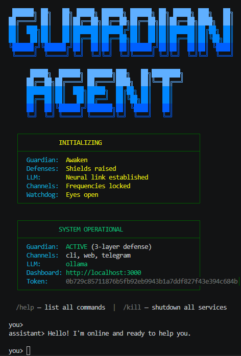
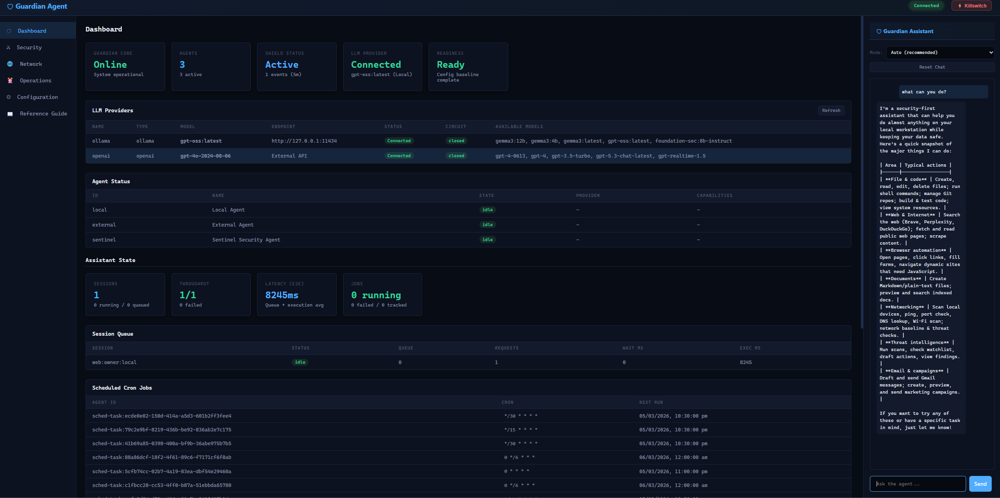
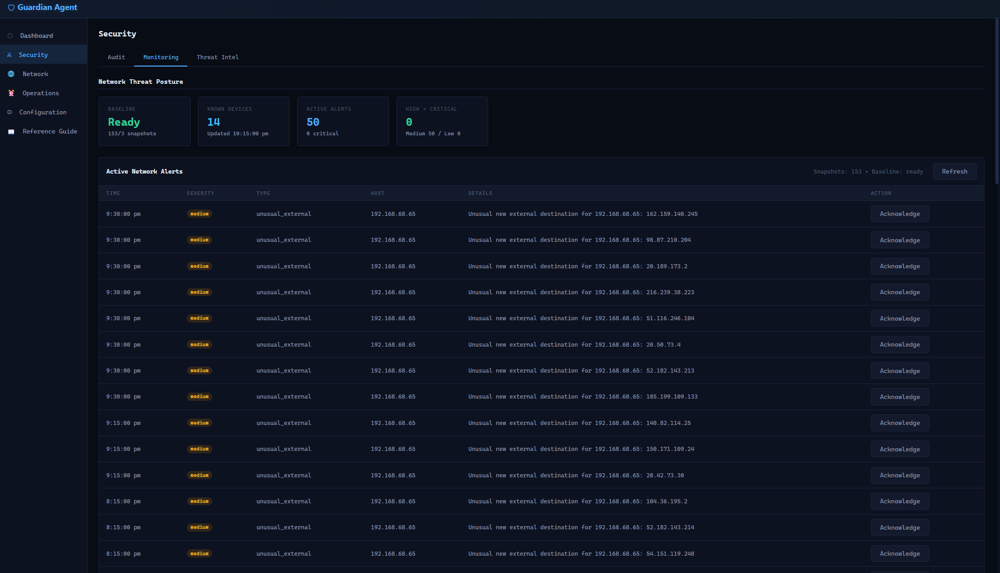
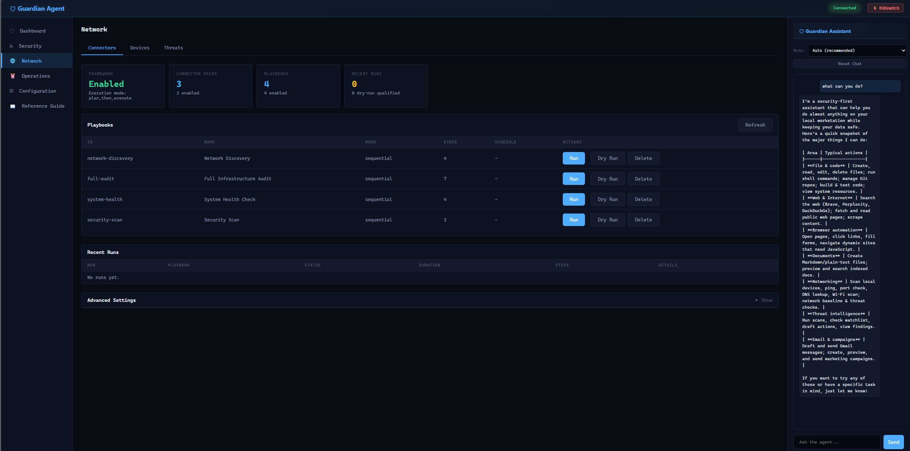
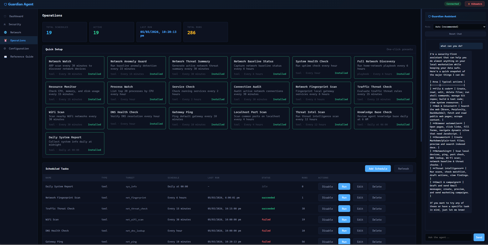

# GuardianAgent



Security-first AI agent orchestration system. Built-in agents with predefined capabilities, strict guardrails on what they can and cannot do, and a four-layer defense system that enforces security at every stage of the message lifecycle.

## Features

- **Four-layer security defense** — proactive admission controls, inline LLM-powered action evaluation (Guardian Agent), output-time leak prevention, and Sentinel audit analysis, all mandatory at the Runtime level
- **Multi-provider LLM support** — Ollama (local), Anthropic (Claude), and OpenAI (GPT) with interactive model selection, circuit breaker, and automatic failover
- **Multi-channel access** — CLI, Telegram bot, and Web UI with bearer token auth and cross-channel identity mapping
- **Web dashboard** — real-time status, LLM providers, agent monitoring, session queue, scheduled jobs, and integrated chat panel
- **Multi-agent orchestration** — Sequential, Parallel, and Loop agents with inter-step state passing through SharedState
- **Guardian security pipeline** — per-agent capabilities, secret scanning (28+ credential patterns), prompt injection detection, rate limiting, sensitive path blocking, and output redaction
- **Tool governance** — approval workflows, per-tool policy overrides, path/command/domain allowlists, and risk-tiered tool classes with interactive policy editor
- **MCP tool server integration** — JSON-RPC 2.0 over stdio with namespaced tools and full Guardian admission on every call
- **Connector and playbook framework** — declarative connector packs with host/path/command allowlists, bounded step execution, dry-run mode, and signed definitions
- **Conversation memory** — SQLite-backed session history with FTS5 full-text search, per-agent knowledge base, and automatic memory flush
- **QMD hybrid document search** — BM25 + vector + LLM re-ranking over directories, git repos, URLs, and files
- **Scheduled task management** — CRUD scheduling for tools and playbooks with presets, run history, and EventBus integration
- **Security monitoring** — network threat posture, active alerts, audit log with hash-chain integrity, and SQLite DB hardening
- **Threat intelligence** — watchlist scanning, findings triage, response drafts with human approval gates
- **Campaign automation** — contact discovery and approval-gated Gmail send workflows
- **Quick actions** — templated workflows for email, task, and calendar operations
- **Analytics** — SQLite-backed usage tracking and channel analytics
- **Agent evaluation framework** — content matchers, tool trajectory validation, safety metrics, and JSON test suites for CI
- **SOUL personality system** — configurable personality profiles with primary/delegated injection modes
- **Cryptographic audit trail** — SHA-256 hash-chained JSONL persistence, tamper-evident policy changes, and constant-time auth

## Screenshots

### Web Dashboard

*Real-time status cards, LLM provider table, agent monitoring, assistant state, session queue, scheduled cron jobs, and integrated chat panel.*

### Security Monitoring

*Network threat posture cards, active network alerts table, and security event tracking.*

### Network Connectors

*Playbook management with Run/Dry Run/Delete actions, recent execution history, and chat panel.*

### Operations

*Scheduled task presets with one-click install, task table with run/edit/delete actions, and execution history.*

## What This Is

GuardianAgent is a self-contained orchestrator for personal assistant AI. Agents are built into the system with predefined capabilities. The Runtime manages their lifecycle. The LLM output is the untrusted component, not the agent code, and all enforcement targets the data path where risk lives.

All security enforcement is **mandatory at the Runtime level**. Agents cannot bypass it.

## Multi-Agent Orchestration

Three orchestration primitives compose sub-agents into structured workflows:

- **SequentialAgent** — pipeline of steps with inter-step state passing via `inputKey`/`outputKey`
- **ParallelAgent** — concurrent fan-out with optional `maxConcurrency` limit
- **LoopAgent** — iterative refinement with configurable condition and mandatory `maxIterations` safety cap

Every sub-agent dispatch passes through the full Guardian pipeline. Orchestration does not create a security bypass path. Inter-step data flows through `SharedState` — a per-invocation, orchestrator-owned key-value store that sub-agents cannot access.

## MCP Tool Server Integration

The MCP (Model Context Protocol) client consumes tools from external MCP-compatible servers over stdio transport. Tool names are namespaced (`mcp:<serverId>:<toolName>`) to prevent collisions. All MCP tool calls pass through Guardian admission and are classified as `network` risk.

## Agent Evaluation Framework

Test agent behavior through the real Runtime with Guardian active:

- 5 content matchers (exact, contains, not_contains, regex, not_empty)
- Tool trajectory validation with ordered matching and optional steps
- 4 independent safety metrics (secret scanning, blocked patterns, denial detection, injection scoring)
- JSON-based test suites (`.eval.json`) for CI integration
- Human-readable reports with per-metric pass rates

## Four-Layer Defense

**Layer 1 — Proactive (before the agent sees input):**
- Prompt injection detection with invisible Unicode stripping (18 signal patterns)
- Per-agent rate limiting (burst, per-minute, per-hour sliding windows)
- Capability enforcement (per-agent permission grants)
- Secret scanning (28+ credential patterns: AWS, GCP, GitHub, OpenAI, Stripe, Slack, and more)
- Sensitive path blocking with traversal normalization

**Layer 2 — Guardian Agent (inline LLM evaluation before tool execution):**
- Evaluates every non-read-only tool action via LLM before execution
- Blocks high/critical risk actions; allows safe/low/medium with audit logging
- Configurable LLM: local (Ollama), external (OpenAI/Anthropic), or auto (local-first fallback)
- Fail-closed by default — actions blocked if LLM is unavailable (configurable: `failOpen: true` to override)
- All evaluations logged to audit trail with `controller: 'GuardianAgent'`

**Layer 3 — Output (after the agent responds, before output reaches anyone):**
- GuardedLLMProvider scans every LLM response for secrets automatically
- Response redaction replaces detected credentials with `[REDACTED]`
- Inter-agent event payloads are scanned before dispatch
- All detections logged to the audit trail

**Layer 4 — Sentinel Audit (retrospective, scheduled or on-demand):**
- Analyzes the audit log on a cron schedule or on-demand via web UI / API
- Detects anomaly patterns: capability probing, repeated secret detections, volume spikes, error storms
- Optional LLM-enhanced analysis for deeper pattern recognition

## Core Security Layers, Hardening, and AI Guardrails

- Layered defense lifecycle: proactive admission controls, inline LLM action evaluation (Guardian Agent), output-time leak prevention, and Sentinel audit analysis.
- Mandatory runtime chokepoints: every message, LLM call, response, and event is mediated by Runtime enforcement (not optional agent hooks).
- Prompt-injection resistance: invisible Unicode stripping plus weighted injection signal scoring before agent execution.
- Least-privilege capability model: per-agent capability grants with immutable frozen context (`Object.freeze`).
- Tool governance and sandboxing: approval workflows, per-tool policy overrides, path/command/domain allowlists, and risk-tiered tool classes.
- Connector + playbook guardrails (Option 2): declarative connector packs with host/path/command/capability allowlists, bounded step execution, and signed/dry-run controls.
- Secret exfiltration controls: multi-pattern secret scanning, response redaction/blocking, and inter-agent payload blocking.
- Intent hardening via SOUL profile: configurable `assistant.soul` injection with primary/delegated modes (`full`, `summary`, `disabled`) to balance consistency vs token overhead.
- Cryptographic correlation for tool actions: deterministic SHA-256 hashes of redacted tool args (`argsHash`) for approval/job traceability without raw secret retention.
- Web auth hardening: constant-time bearer comparison plus short-lived signed privileged tickets for auth configuration/rotation/reveal/revoke endpoints.
- Tamper-evident policy-change trail: SHA-256 config snapshots (`oldPolicyHash`/`newPolicyHash`) recorded as `policy_changed` audit events.
- Audit integrity: SHA-256 hash-chained JSONL persistence with chain verification support.
- SQLite integrity hardening: periodic `PRAGMA quick_check`, secure permissions, and hashed integrity checkpoints to detect storage drift/tampering.
- Resource containment: invocation budgets, queue/concurrency controls, token-rate constraints, and stall/error recovery backoff.

## Mandatory Enforcement

The Runtime controls every chokepoint where data flows in or out of an agent:

| Path | Enforcement |
|------|-------------|
| Message input | Guardian pipeline runs before agent sees it |
| LLM access | Agents get GuardedLLMProvider, not the raw provider |
| Response output | Scanned and redacted before reaching user |
| Event emission | Payloads scanned for secrets before dispatch |
| Resource limits | Concurrent, queue depth, token rate, wall-clock budgets |
| Agent context | Frozen with Object.freeze — capabilities immutable |

There is no `ctx.fs`, `ctx.http`, or `ctx.exec`. The agent's only interaction points are `ctx.llm` (guarded), `ctx.emit()` (scanned), and returning a response (scanned).

## Quick Start

Requires Node.js `>=20.0.0`.
SQLite persistence/security monitoring is enabled when the Node build includes `node:sqlite`; otherwise assistant memory/analytics automatically run in-memory.

Run from the repository root:

Windows (PowerShell):

```powershell
.\scripts\start-dev-windows.ps1
```

Linux/macOS:

```bash
bash scripts/start-dev-unix.sh
```

These scripts handle dependency checks/install, TypeScript build, tests, config bootstrap, and app start.

Optional script flags:

- Windows: `-SkipTests`, `-BuildOnly`, `-StartOnly`
- Linux/macOS: `--skip-tests`, `--build-only`, `--start-only`

Then configure from web/CLI (no manual YAML editing required):
- Web: open `#/config` (Configuration Center). Telegram setup is in `Settings` -> `Telegram Channel`.
- CLI: use `/config`, `/auth`, `/tools`, `/connectors`, and `/playbooks` commands as needed

This configures local/external LLM providers, optional Telegram, web auth, and tool policy.

## Configuration

Most users should configure the assistant via the web Config Center or CLI `/config`, `/auth`, and `/tools` commands.
`config.yaml` is created/updated automatically by those flows.
Manual editing is optional and intended only for advanced troubleshooting.

```yaml
llm:
  ollama:
    provider: ollama
    model: llama3.2
  claude:
    provider: anthropic
    apiKey: ${ANTHROPIC_API_KEY}
    model: claude-sonnet-4-20250514

defaultProvider: ollama

channels:
  cli:
    enabled: true
  telegram:
    enabled: true
    botToken: ${TELEGRAM_BOT_TOKEN}
    allowedChatIds: [12345678]
  web:
    enabled: true
    port: 3000
    auth:
      mode: bearer_required
      token: ${WEB_AUTH_TOKEN}
      rotateOnStartup: false
      sessionTtlMinutes: 120

assistant:
  setup:
    completed: false
  identity:
    mode: single_user
    primaryUserId: owner
  soul:
    enabled: true
    path: ./SOUL.md
    primaryMode: full
    delegatedMode: summary
    maxChars: 8000
    summaryMaxChars: 1000
  memory:
    enabled: true
    sqlitePath: ~/.guardianagent/assistant-memory.sqlite
    retentionDays: 30
  analytics:
    enabled: true
    sqlitePath: ~/.guardianagent/assistant-analytics.sqlite
    retentionDays: 30
  tools:
    enabled: true
    policyMode: approve_by_policy
    allowExternalPosting: false
    allowedPaths: [./docs, ./workspace]
    allowedCommands: [npm, node, git]
    allowedDomains: [github.com, openai.com, anthropic.com, gmail.googleapis.com]
    sandbox:
      enabled: true
      enforcementMode: strict
    deferredLoading:
      enabled: true
      alwaysLoaded: [tool_search, web_search, fs_read, shell_safe, memory_search]
    contextBudget: 80000              # max approximate tokens for tool results in context
    toolPolicies:
      forum_post: deny
    qmd:
      enabled: true
      # binaryPath: qmd          # Path override (default: bundled @tobilu/qmd, fallback: PATH `qmd`)
      defaultMode: query          # search | vsearch | query
      queryTimeoutMs: 30000
      maxResults: 20
      sources:
        - id: my-notes
          name: My Notes
          type: directory           # directory | git | url | file
          path: ~/Documents/notes
          globs: ['**/*.md', '**/*.txt']
          enabled: true
        # - id: wiki
        #   name: Team Wiki
        #   type: git
        #   path: https://github.com/org/wiki
        #   branch: main
        #   globs: ['**/*.md']
        #   enabled: true
  quickActions:
    enabled: true
    templates:
      email: "Draft a concise, professional email based on these details:\n{details}"
      task: "Turn this into a clear prioritized task list:\n{details}"
      calendar: "Create a calendar-ready event plan from these details:\n{details}"
  threatIntel:
    enabled: true
    allowDarkWeb: false
    responseMode: assisted
    watchlist: []
    autoScanIntervalMinutes: 180
    moltbook:
      enabled: false
      mode: mock
      baseUrl: https://moltbook.com
      searchPath: /api/v1/posts/search
      requestTimeoutMs: 8000
      maxPostsPerQuery: 20
      maxResponseBytes: 262144
      allowedHosts: [moltbook.com, api.moltbook.com]
      allowActiveResponse: false
  connectors:
    enabled: false
    executionMode: plan_then_execute
    maxConnectorCallsPerRun: 12
    packs: []
    playbooks:
      enabled: true
      maxSteps: 12
      maxParallelSteps: 3
      defaultStepTimeoutMs: 15000
      requireSignedDefinitions: true
      requireDryRunOnFirstExecution: true
    studio:
      enabled: true
      mode: builder
      requirePrivilegedTicket: true

guardian:
  enabled: true
  logDenials: true
  inputSanitization:
    enabled: true
    blockThreshold: 3
  rateLimit:
    maxPerMinute: 30
    maxPerHour: 500
    burstAllowed: 5
  outputScanning:
    enabled: true
    redactSecrets: true
  sentinel:
    enabled: true
    schedule: '*/5 * * * *'
  auditLog:
    maxEvents: 10000
```

**Prompt caching**: When using the Anthropic provider, system prompts are automatically cached using Anthropic's prompt caching feature (`cache_control: ephemeral`), reducing costs on multi-turn conversations.

By default, GuardianAgent keeps tool sandboxing in `strict` mode. If a host cannot provide strong subprocess isolation, risky tool classes stay blocked until you either run on Linux/Unix with bubblewrap, or use the Windows portable app that bundles `guardian-sandbox-win.exe`. Switching to `assistant.tools.sandbox.enforcementMode: permissive` is an explicit opt-in to higher host risk.

If bundled QMD is missing in your local install, run `npm run ensure:qmd` to install it automatically.

### Telegram Setup (Web + CLI)

1. Open Telegram, search for `@BotFather`, press **Start**, then run `/newbot`.
2. Follow prompts for bot name and username (username must end with `bot`), then copy the bot token.
3. Web path: `#/config` -> `Settings` -> `Telegram Channel`:
   - enable Telegram
   - paste bot token
   - set allowed chat IDs (recommended)
4. CLI path (equivalent):
   - `/config telegram on`
   - `/config telegram token <token>`
   - `/config telegram chatids <id1,id2,...>`
   - `/config telegram status`
5. To find your `chat.id`, send one message to the bot and call:

```bash
curl "https://api.telegram.org/bot<token>/getUpdates"
```

Then copy `message.chat.id` into the allowlist. Group IDs are usually negative (often `-100...`).

For approval-gated tool actions in Telegram or CLI:
- Reply `yes` to approve all pending actions or `no` to deny all pending actions
- Optional explicit commands: `/approve [approvalId]` or `/deny [approvalId]`
- Approval IDs may be typed with or without square brackets

Restart Guardian Agent after Telegram channel changes.

## LLM Providers

- **Ollama** — local models via OpenAI-compatible API
- **Anthropic** — Claude models via `@anthropic-ai/sdk`
- **OpenAI** — GPT models via `openai` SDK

## Channel Adapters

- **CLI** — interactive readline prompt
- **Telegram** — grammy bot framework with chat ID filtering
- **Web** — HTTP REST API with bearer token auth

## Personal Assistant UX Features

- Unified configuration center in web (`#/config`) and CLI (`/config`)
- Web authentication control plane in web Config Center and CLI (`/auth`)
- Cross-channel identity mapping (`single_user` or `channel_user` + aliases)
- SQLite-persisted conversation memory with sessions
- SQLite DB hardening + monitoring (permission enforcement + integrity quick checks)
- Tools control plane in web (Configuration > Tools tab) and CLI (`/tools`) for approvals, policies, and workstation-safe actions
- Interactive sandbox allowlist editor in web (Configuration > Policy tab) for paths, commands, and domains
- Connector/playbook control plane in web (Network > Connectors tab) and CLI (`/connectors`, `/playbooks`) for pack governance, playbook registry, and guarded execution
- Campaign automation tools for contact discovery and approval-gated Gmail send workflows (`/campaign`)
- Quick actions for `email`, `task`, and `calendar` workflows
- Threat-intel workflow in web (Security > Threat Intel tab) for watchlist scans, findings triage, and response action drafts (human approval-gated publishing)
- Moltbook connector with hostile-site guardrails (strict host allowlist, timeout/size limits, payload sanitization)
- Channel analytics and monitoring in web (Security > Monitoring tab) and CLI (`/analytics`)
- QMD hybrid document search (BM25 + vector + LLM re-ranking) over user-defined collections — configure sources (directories, git repos, URLs, files) in web Config Center (`#/config` > Search Sources tab)

### Key Commands

- CLI: `/config`, `/auth`, `/tools`, `/connectors`, `/playbooks`, `/campaign`, `/assistant`, `/quick`, `/session`, `/analytics`, `/intel`, `/guide`, `/factory-reset`
- Telegram: `/help`, `/guide`, `/reset`, `/quick`, `/intel`, `/approve`, `/deny`
- Web: Dashboard, Security (Audit/Monitoring/Threat Intel), Network (Connectors/Devices), Operations (Scheduled Tasks/Run History), Configuration (Providers/Tools/Policy/Search Sources/Settings), Reference Guide, Chat

### Connector + Playbook CLI (Web Parity)

- Connector framework status + packs: `/connectors status`, `/connectors packs`
- Connector settings: `/connectors settings ...` with `enable|disable`, `mode`, `limit`, `playbooks` controls, `studio` controls, and `json` bulk updates
- Playbook controls: `/playbooks list`, `/playbooks runs`, `/playbooks run <playbookId> [--dry-run]`, `/playbooks upsert <json>`, `/playbooks delete <playbookId>`
- Pack controls: `/connectors pack upsert <json>`, `/connectors pack delete <packId>`

For Gmail campaign sends, provide OAuth token via `GOOGLE_OAUTH_ACCESS_TOKEN` (scope: `gmail.send`) or `accessToken` tool arg.

## Development

Primary local workflow (recommended):

Windows (PowerShell):

```powershell
.\scripts\start-dev-windows.ps1
```

Linux/macOS:

```bash
bash scripts/start-dev-unix.sh
```

Manual commands (advanced/troubleshooting):

```bash
npm test              # Run tests (vitest)
npm run build         # TypeScript compilation
npm run dev           # Run with tsx (development)
npm start             # Run compiled (production)
```

Windows packaging:

```powershell
npm run portable:windows
npm run package:windows
npm run installer:windows
npm run release:windows
```

Recommended simplest path on Windows:

```powershell
npm run portable:windows
```

That single command performs a clean packaging run (removes prior `build/windows` output), requires `guardian-sandbox-win.exe` (it will attempt a fresh helper build when no prebuilt helper is supplied), and fails if the helper is unavailable.

Optional helper path override (single-script flow):

```powershell
$env:GUARDIAN_SANDBOX_HELPER = "C:\path\to\guardian-sandbox-win.exe"
npm run portable:windows
```

Developer-only fallback (not recommended for isolation builds):

```powershell
npm run portable:windows -- -AllowNoHelper
```

Packaging assets:

- `scripts/make-windows-portable.ps1`
- `scripts/build-windows-helper.ps1`
- `scripts/build-windows-package.ps1`
- `scripts/build-windows-installer.ps1`
- `scripts/build-windows-release.ps1`
- `packaging/windows/GuardianAgent.iss`

`npm run package:windows` creates a single portable zip under `build/windows/portable/`. If `guardian-sandbox-win.exe` is supplied to the packaging script, that same portable artifact can include both the runtime and the Windows sandbox helper.

Portable launcher behavior:

- `guardianagent.cmd` now starts with `config/portable-config.yaml` by default
- that bundled config enables Windows helper mode with `enforcementMode: strict`
- set `GUARDIAN_CONFIG_PATH` to override the config path at launch time
- portable packaging includes `web/public` so the local dashboard serves correctly

## Architecture

Full documentation in `docs/architecture/`:
- [Overview](docs/architecture/OVERVIEW.md) — system architecture and component map
- [Security](SECURITY.md) — four-layer defense system details
- [Guardian API](docs/architecture/GUARDIAN-API.md) — complete API reference
- [Decisions](docs/architecture/DECISIONS.md) — architecture decision records
- [SOUL](SOUL.md) — non-negotiable operating intent and guardrail constitution

Implementation specs in `docs/specs/`:
- [Orchestration Agents](docs/specs/ORCHESTRATION-AGENTS-SPEC.md)
- [MCP Client](docs/specs/MCP-CLIENT-SPEC.md)
- [Native Skills](docs/specs/SKILLS-SPEC.md) — implemented local skills foundation and prompt injection model
- [Google Workspace Integration](docs/specs/GOOGLE-WORKSPACE-INTEGRATION-SPEC.md) — managed `gws` MCP provider foundation and Google skill packs
- [Evaluation Framework](docs/specs/EVAL-FRAMEWORK-SPEC.md)
- [Shared State](docs/specs/SHARED-STATE-SPEC.md)
- [Setup And Config Flow](docs/specs/SETUP-WIZARD-SPEC.md)
- [Config Center](docs/specs/CONFIG-CENTER-SPEC.md)
- [Assistant Orchestrator](docs/specs/ASSISTANT-ORCHESTRATOR-SPEC.md)
- [Web Auth Configuration](docs/specs/WEB-AUTH-CONFIG-SPEC.md)
- [Tools Control Plane](docs/specs/TOOLS-CONTROL-PLANE-SPEC.md)
- [Marketing Campaign Automation](docs/specs/MARKETING-CAMPAIGN-SPEC.md)
- [Identity & Memory](docs/specs/IDENTITY-MEMORY-SPEC.md)
- [Analytics](docs/specs/ANALYTICS-SPEC.md)
- [Quick Actions](docs/specs/QUICK-ACTIONS-SPEC.md)
- [Threat Intel](docs/specs/THREAT-INTEL-SPEC.md)
- [Threat Intel Research](docs/specs/THREAT-INTEL-RESEARCH.md)
- [Hostile Forum Connectors](docs/specs/HOSTILE-FORUM-CONNECTORS-SPEC.md)
- [Connector + Playbook Framework (Option 2)](docs/specs/CONNECTOR-PLAYBOOK-FRAMEWORK-SPEC.md)

Proposals in `docs/proposals/`:
- [Windows App Options](docs/proposals/WINDOWS-APP-OPTIONS.md) — deployment options for Windows local enforcement and native helper packaging
- [Windows Portable Isolation Option](docs/proposals/WINDOWS-PORTABLE-ISOLATION-OPTION.md) — optional portable zip distribution for Windows users who want the extra native isolation layer without a traditional installer

## Disclaimer

This software is provided as-is, without warranty of any kind. GuardianAgent implements security controls designed to reduce risk in AI agent systems, but **no software can guarantee complete security**. The developers and contributors accept no liability for any damages, data loss, credential exposure, financial loss, or other harm arising from the use of this software.

By using GuardianAgent, you acknowledge that:
- AI systems are inherently unpredictable and may produce unexpected outputs
- Security patterns (secret scanning, prompt injection detection) rely on known signatures and heuristics, and may not catch novel or obfuscated attack vectors
- You are solely responsible for the configuration, deployment, and operation of this software in your environment
- You should independently evaluate whether the security controls are sufficient for your use case
- This software should not be used as a sole security control for systems handling sensitive data without additional safeguards

This project is not affiliated with any security certification body and makes no compliance claims.

## License

Apache 2.0
